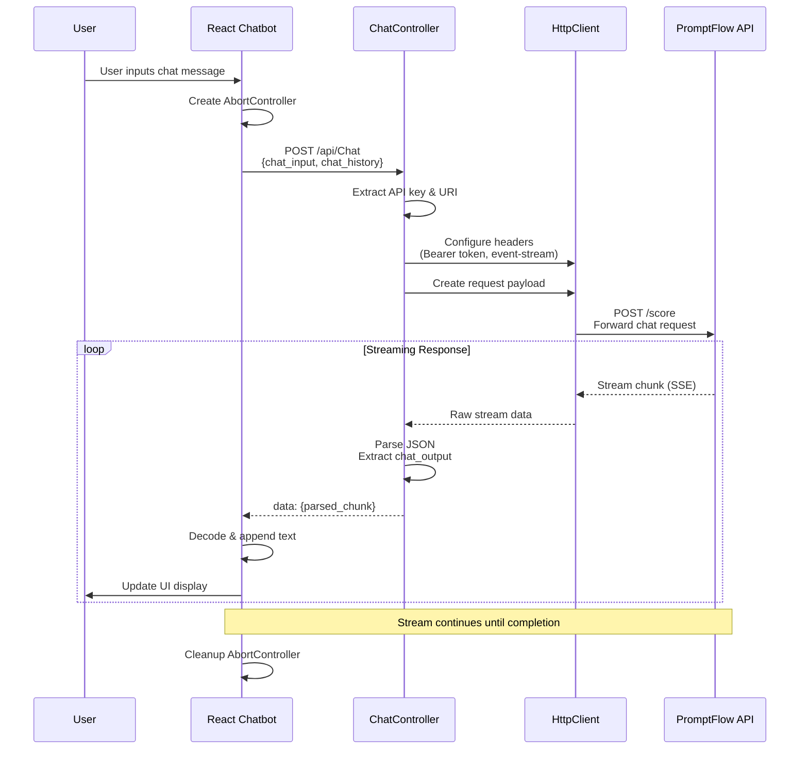
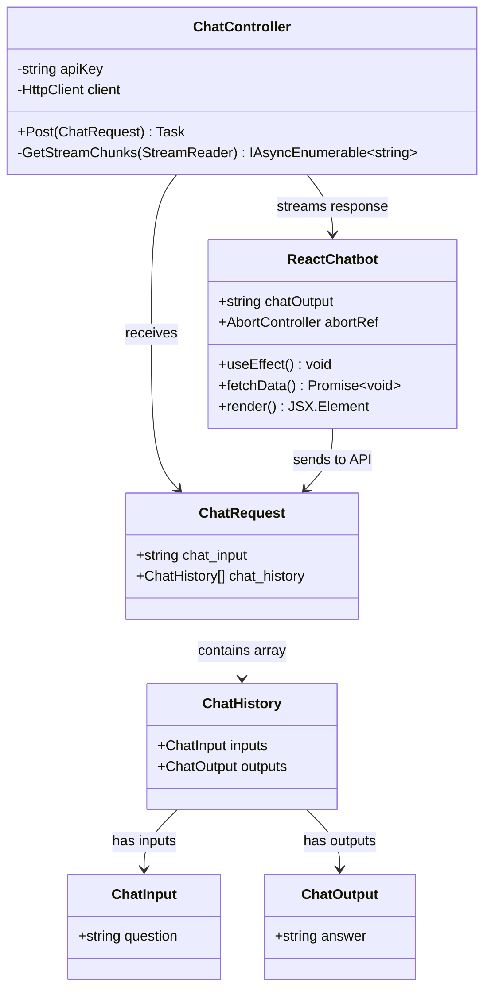

# PromptFlow-React-Streaming-chatbot

This Sample Code is provided for the purpose of illustration only and is not intended to be used in a production environment. THIS SAMPLE CODE AND ANY RELATED INFORMATION ARE PROVIDED "AS IS" WITHOUT WARRANTY OF ANY KIND, EITHER EXPRESSED OR IMPLIED, INCLUDING BUT NOT LIMITED TO THE IMPLIED WARRANTIES OF MERCHANTABILITY AND/OR FITNESS FOR A PARTICULAR PURPOSE. We grant You a nonexclusive, royalty-free right to use and modify the Sample Code and to reproduce and distribute the object code its authors,or anyone else involved in the creation, production, or delivery of the scripts be liable for any damages whatsoever (including, without limitation, damages for loss of business profits, business interruption, loss of business information, or other pecuniary loss) arising out of the use of or inability to use the sample scripts or documentation, even if its has been advised of the possibility of such damages

## Architecture Overview

This application implements a streaming chatbot using React frontend and ASP.NET Core backend, with integration to Azure PromptFlow.

## System Architecture

```mermaid
graph TB
    subgraph "Client Side"
        RC[React Chatbot Component]
        RUI[UI Display<br/>- Chat Input<br/>- Streaming Output]
    end
    
    subgraph "Backend API"
        CC[ChatController<br/>ASP.NET Core]
        HTTP[HttpClient]
        SSE[Server-Sent Events<br/>Streaming]
    end
    
    subgraph "External Services"
        PF[PromptFlow API<br/>Azure AI Service]
    end
    
    RC -->|POST /api/Chat<br/>ChatRequest| CC
    CC -->|Forward Request<br/>Bearer Token| HTTP
    HTTP -->|POST /score<br/>JSON Payload| PF
    PF -->|Stream Response<br/>text/event-stream| HTTP
    HTTP -->|Parse & Process<br/>Stream Chunks| SSE
    SSE -->|data: {chunk}| RC
    RC -->|Update State<br/>Real-time Display| RUI
    
    style RC fill:#e1f5fe
    style CC fill:#f3e5f5
    style PF fill:#e8f5e8
```

## Data Flow Sequence



## Class Diagram



## Component Architecture

```mermaid
graph TD
    subgraph "React Application"
        CB[Chatbot Component]
        STATE[State Management<br/>- chatOutput: string<br/>- abortRef: AbortController]
        HOOKS[React Hooks<br/>- useState<br/>- useEffect<br/>- useRef]
        
        subgraph "UI Elements"
            TITLE[Header: 'Chatbot (Streaming)']
            OUTPUT[Output Display<br/>- Styled div<br/>- Pre-wrap text<br/>- Streaming updates]
        end
        
        subgraph "Network Layer"
            FETCH[Fetch API<br/>- POST request<br/>- Event stream handling]
            STREAM[Stream Processing<br/>- TextDecoder<br/>- Chunk parsing<br/>- SSE handling]
        end
    end
    
    CB --> STATE
    CB --> HOOKS
    CB --> TITLE
    CB --> OUTPUT
    CB --> FETCH
    FETCH --> STREAM
    STREAM --> STATE
    STATE --> OUTPUT
    
    style CB fill:#e3f2fd
    style STATE fill:#f1f8e9
    style FETCH fill:#fff3e0
    style STREAM fill:#fce4ec
```

## Technology Stack

- **Frontend**: React, TypeScript, Fetch API
- **Backend**: ASP.NET Core, C#
- **Communication**: Server-Sent Events (SSE), HTTP/HTTPS
- **External Service**: Azure PromptFlow API
- **Data Format**: JSON for requests, Event Stream for responses

## Key Features

- **Real-time Streaming**: Server-Sent Events for live response updates
- **Abort Control**: Request cancellation capability
- **Error Handling**: Graceful error management and user feedback
- **Type Safety**: TypeScript interfaces and C# models
- **Async Processing**: Non-blocking stream processing
