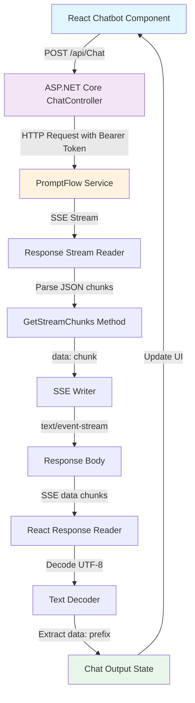

# PromptFlow-React-Streaming-chatbot

This Sample Code is provided for the purpose of illustration only and is not intended to be used in a production environment. THIS SAMPLE CODE AND ANY RELATED INFORMATION ARE PROVIDED "AS IS" WITHOUT WARRANTY OF ANY KIND, EITHER EXPRESSED OR IMPLIED, INCLUDING BUT NOT LIMITED TO THE IMPLIED WARRANTIES OF MERCHANTABILITY AND/OR FITNESS FOR A PARTICULAR PURPOSE. We grant You a nonexclusive, royalty-free right to use and modify the Sample Code and to reproduce and distribute the object code its authors,or anyone else involved in the creation, production, or delivery of the scripts be liable for any damages whatsoever (including, without limitation, damages for loss of business profits, business interruption, loss of business information, or other pecuniary loss) arising out of the use of or inability to use the sample scripts or documentation, even if its has been advised of the possibility of such damages

## Architecture Overview

The following diagram shows the Server-Sent Events (SSE) streaming flow between the React frontend and ASP.NET Core backend:

### Flow Description

1. **React Chatbot Component** initiates a POST request to `/api/Chat` endpoint
2. **ASP.NET Core ChatController** receives the request and forwards it to the PromptFlow service
3. **PromptFlow Service** processes the chat input and returns an SSE stream
4. **Response Stream Reader** reads the incoming stream data  
5. **GetStreamChunks Method** parses JSON chunks and extracts chat output
6. **SSE Writer** formats data as `data: {chunk}` and sends via text/event-stream
7. **React Response Reader** receives the SSE stream chunks
8. **Text Decoder** decodes UTF-8 data and extracts content after `data:` prefix
9. **Chat Output State** is updated with the streaming text
10. **UI Update** renders the real-time streaming response
